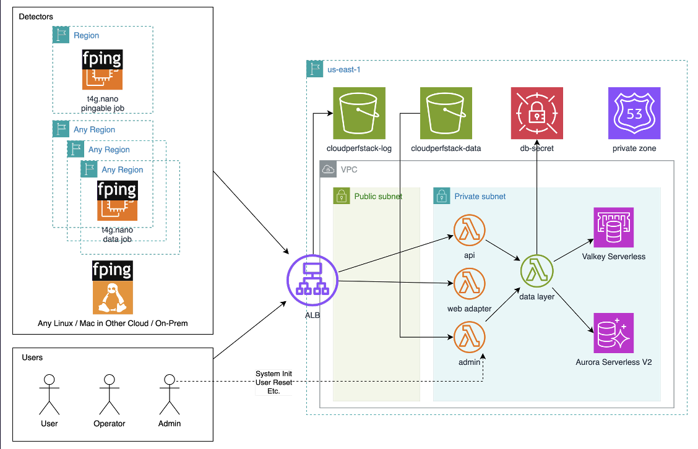
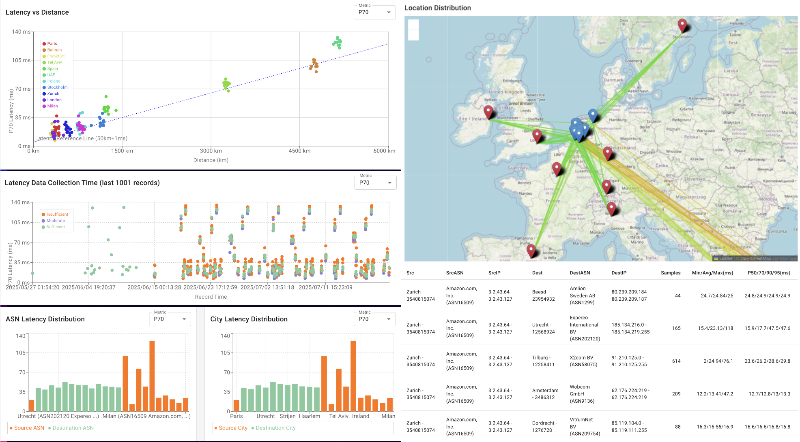

# CloudPerf 是一个自动网络质量分析工具

CloudPerf是一个网络性能监控系统，提供跨多个地理位置的实时延迟测量和性能可视化。它使组织能够通过直观的web仪表板监控网络性能、分析链路延迟并优化路由决策。

该系统通过使用分布式节点的fping收集网络性能数据、基于AWS无服务器架构构建的集中式数据处理以及用于数据可视化和分析的web查询界面组成。



核心功能包括：

* IP/ASN 查询
* 提供基于 国家/城市/asn 延迟数据查询
* 自定义分组统计
* 用户权限管理



## 部署

### 环境准备
- Node.js >= 22.x
- [AWS CLI](https://docs.aws.amazon.com/zh_cn/cli/latest/userguide/getting-started-install.html) (并 [配置](https://docs.aws.amazon.com/zh_cn/cli/latest/userguide/cli-chap-configure.html) AWS 部署权限)
- AWS CDK CLI (`npm install -g aws-cdk`)
- Python 3.12 (非必须，运行本地脚本测试时使用)
- Docker (非必须，制作fping二进制程序和python依赖包时使用)

### 资源部署

代码准备：

```bash
git clone https://github.com/tansoft/cloudperf.git
cd cloudperf
npm install
# 可以通过 CDK_DEFAULT_REGION 指定在其他区域部署，默认部署在us-east-1，注意相关的脚本也会依赖这个环境变量
# export CDK_DEFAULT_REGION=ap-northeast-1
cdk bootstrap
cdk synth
```

最后部署可以有两种选择：

* 只使用alb http接口，直接部署

```bash
cdk deploy
```

* 如果想使用自定义域名和https，指定以下参数部署：

  ```domainName``` 指定最终上线的域名

  ```hostedZoneId``` 上级域名在Route53上的ZoneId，用于自动申请acm证书和开通域名解释（如：customer.com 的 ZoneId 为 Zxxxxx）

```bash
cdk deploy -c domainName=ping.customer.com -c hostedZoneId=Zxxxxx
```

> 如果遇到版本不兼容情况，尝试重新安装依赖：
> ```bash
> npm install aws-cdk-lib constructs
> # 或者重新安装依赖库
> rm package-lock.json 
> npm install -g aws-cdk@latest
> npm install aws-cdk-lib@latest
> ```

### 系统设置

#### 进行数据库初始化

```bash
# 创建数据库
./script/admin_exec.sh exec_sql init_db
# 上传建表SQL，上传到 cloudperfstack-dataxxx-xxx 桶中的import-sql目录中的sql和zip文件会被自动执行
./script/upload_sql.sh src/data/import-sql/init.sql
```

#### 创建管理账号

使用命令行脚本调用 admin Lambda 完成管理员账号的创建，用户名已存在则会重置密码。

```bash
./script/admin_exec.sh create_user admin
# 执行完成可以看到 账号: 密码
# general password for myusername: xxxx
```

至此，可以进行系统登录了，在 cdk 的输出里，找到 customHost 进行登录。

#### 修改账号密码

通过上述账号密码登录系统后，点击右上方的 用户名，可以进行密码修改。

#### 导入数据（如果有）

导入数据的方法是把sql文件或打包的zip文件放到 cloudperfstack-data 开头的 s3 的 import-sql 目录中，程序会自动触发导入。

由于执行导入任务的 Lambda 函数有15分钟执行时间限制，因此如果导入数据太多，建议拆分sql文件再上传，参考以下代码：

```bash
# 由于 lambda 15分钟执行时间限制，大概可以处理14万行Insert，因此建议大的sql文件进行最多10万行的切割，注意sql文件中每一行为一条完整的语句，避免切割后sql断开
split -l 100000 range.sql range_split_
for file in range_split_*; do mv "${file}" "${file}.sql" && zip "${file}.zip" "${file}.sql" && rm "${file}.sql"; done
# 如果sql有前后关系，建议顺序放置拆分文件 range_split_*.zip 到s3执行
```

如果单条的SQL操作，可以直接在维护网页 /maintenance 中操作

或在 lambda 控制台调用 admin Lambda，以下是测试事件参考：

```bash
# 执行s3 sql文件导入
{"action": "exec_sqlfile", "param": "s3://my-bucket/sql/updates.zip"}
# 直接执行sql
{"action": "exec_sql", "param": "insert into xxx"}
{"action": "exec_sql", "param": "select * from asn"}
```

也可以使用以下脚本执行：

```bash
./script/admin_exec.sh exec_sql "select * from country limit 10"
# 返回结果如下：
# 列名: code | name | continent_code | continent_name | update_time
# AD | Andorra | EU | Europe | 2025-01-04 03:46:39
# AE | United Arab Emirates | AS | Asia | 2025-01-04 03:46:39
# AF | Afghanistan | AS | Asia | 2025-01-04 03:46:40
# AG | Antigua and Barbuda |  | North America | 2025-01-05 15:08:09
```

从现有系统中获取常用数据：

```bash
./script/admin_exec.sh mysql_dump "country,city,asn,iprange,cityset"
# 执行完成可以看到sql文件已经导出到s3中，可以进行下载：
# check file in s3://cloudperfstack-dataxxxx-xxxxx/export-sql/
# 2025-03-15 16:55:49  114971605 2025-03-15-08-55-20.zip
```

下载zip包，并上传到新系统的s3桶 import-sql 目录，程序会自动导入数据。

pingable 和 statistics 数据太多且更新较快，不建议全量导出。

#### 配置采集端

主要有两种不同的采集端：

1. 发现可ping ip，进行可ping ip维护，服务名字 fping-pingable：

```bash
# 部署可用ip探测的客户端，集中部署即可，部署多个节点可以加速刷新可用ip列表
./script/deploy_detector.sh aws us-east-1 fping-pingable
```

2. 采集端进行网络延时数据测试、取样并上报，服务名字 fping-job：

```bash
# 部署探测节点，在需要监测网络质量的地方部署，如在aws的32个区域上部署：
# 部署到单个地区
./script/deploy_detector.sh aws ap-southeast-1
# 部署到多个地区
./script/deploy_detector.sh aws "ap-southeast-1 us-east-1"
# 部署到所有region
./script/deploy_detector.sh aws all
# 部署到普通服务器
./script/deploy_detector.sh ssh ec2-user@1.2.3.4
```

部署客户端完成后，建议获取对应公网ip，在 /ipsearch 页面中进行查询，看看是否有该段IP的映射。

如果提示 not found，则证明该IP CIDR范围还没有录入，需要更新IP数据，或通过ec2停止-启动操作更换ip，直到ip解释正确。

客户端正常运行后，可以在网页 /status 页面中看到更新状态，由于aws region和城市名字不一样，状态页面看到的地区会和region不一样，可以自行进行修改。

## 成本

系统采用了全Serverless架构，实际采集成本和部署规模有关，以下列出几种情况下的实际成本：

* 主要成本是数据库，大约 $400-500/月；其次就是部署的采集端，使用最小的机型 t4g.nano (t3.nano) 即可，也可以在其他机器上复用。
* 部署36个采集点的情况下，总花费大概 $1K/月；部署13个采集点的情况下，总花费大概 $600/月。
* 可以随时暂停采集任务，只需要把上述的采集端实例进行释放即可（可以在控制台上终止实例，或者使用 ./script/terminate_aws_detector.sh 脚本进行批量终止）
* 没有任何采集任务时，系统只收取一个数据库的0.5ACU+存储费用，每天花费 <$5，也可以修改为 0 ACU。


## 附录

### 高级设置

在文件 src/layer/datalayer/python/settings.py 中，可以按实际业务情况进行调整：

```bash
# 每个cityid只保存最新的n次记录，默认7次；增加该值，数据更丰富，但是查询等待时间会越长
MAX_RECORDS_PER_CITYID = 7
# 常规缓存过期时间，如 SQL 语句的缓存
CACHE_BASE_TTL=3600
# 常规较长缓存过期时间
CACHE_LONG_TTL=86400
```

### 客户端维护

* 升级客户端二进制程序

```bash
# 升级所有region的fping-job
./script/update_detector.sh aws
# 升级 us-east-1 的 fping-pingable
./script/update_detector.sh aws us-east-1 fping-pingable
```

* 卸载客户端程序

```bash
# 卸载 us-east-1 的 fping-pingable
./script/remove_detector.sh aws us-east-1 fping-pingable
```

* 终止实例

```bash
# 卸载所有region中部署了的fping-job
./script/terminate_aws_detector.sh
# 卸载美东一的fping-pingable
./script/terminate_aws_detector.sh us-east-1 fping-pingable
```

### 源码编译

* 制作 lambda layer：

```bash
# 分别使用 x86_64 和 arm64 的Linux环境，并安装Docker，运行以下脚本，得到对应版本的python依赖库 pythonlib-layer-{ARCH}.zip
cd src/layer
./build-layer.sh
```

* 发布网页修改：

```bash
./script/build_web.sh
#生成新网页文件后，需要重新进行部署：
cdk deploy
```

* 制作 fping 二进制程序：

详细参考 fping 项目的 [build-package.sh](https://github.com/tansoft/fping/blob/develop/setup/build-package.sh)

### 源码解释

```
├── bin
│   └── cloudperf.ts                # CDK 入口和传参设置
├── lib
│   └── cloudperf-stack.ts          # 整个系统的 CDK 部署代码 (VPC, Lambda, RDS 等)
├── script                          # 管理维护常用脚本
│   ├── admin_exec.sh               # 多种管理功能脚本
│   ├── build_web.sh                # 发布网页修改
│   ├── deploy_detector.sh          # 部署采集客户端
│   ├── local_test.sh               # 本地测试环境
│   ├── remove_detector.sh          # 卸载采集客户端
│   ├── terminate_aws_detector.sh   # 终止采集ec2实例
│   ├── update_detector.sh          # 更新采集客户端
│   └── upload_sql.sh               # 上传导入数据的sql
└── src                             # 源代码
    ├── admin
    │   └── lambda_function.py      # 管理使用的工具，无对外接口可以直接调用
    ├── api
    │   └── lambda_function.py      # 对外API接口
    ├── data/import-sql             # 建表数据
    │   ├── init.sql                # 创建 MySQL 基础表
    │   └── data.sql or zip         # 已有采集好的数据（如果有）
    ├── layer                       # lambda 函数层
    │   ├── datalayer/python        # 数据层，给多个lambda使用
    │   │   ├── data_layer.py       # 数据库操作函数
    │   │   └── settings.py         # 系统参数配置
    │   ├── build-layer.sh          # 创建pythonlib-layer
    │   └── pythonlib-layer-{ARCH}.zip  # python 类库层（python里的依赖库，如：PyMysql，redis，requests）
    └── web
        ├── lambda/app/public       # 网站静态发布页
        └── src                     # 网站代码
```

### web 前端构建

Web前端通过 Cline 使用 Claude 3.5 Sonnet V2 生成。提示词参考 [docs/MakeProject.md](docs/MakeProject.md)

```txt
# 相关环境
npm create vite@latest . -- --template react && npm install
npm install @mui/material @emotion/react @emotion/styled @mui/icons-material react-router-dom recharts
npm install axios
npm install miragejs
```
